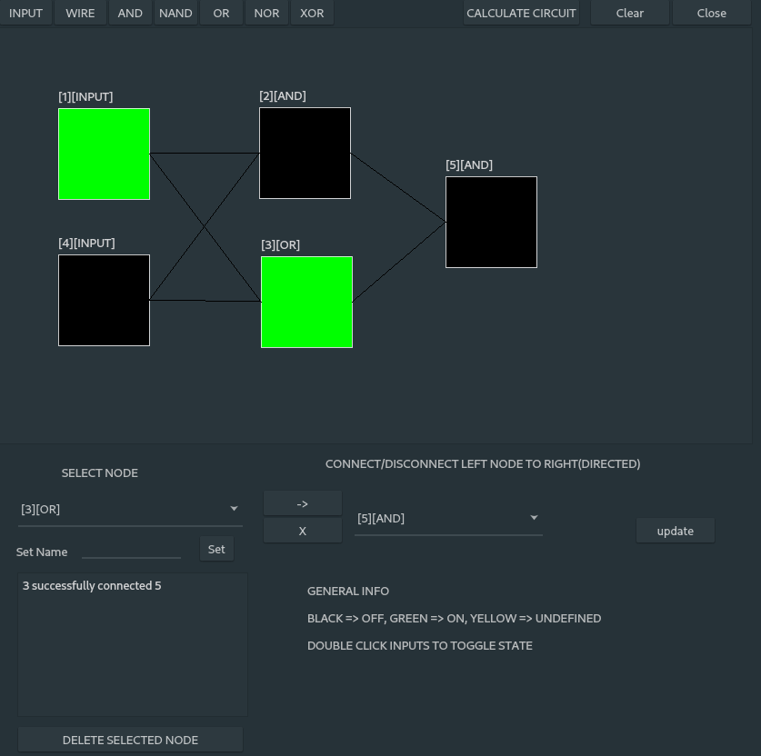

# logic-sim - logic gate simulator
a c++ implementation of a logic gate simulator, done as a qt gui application and console application.
 - OOP structure employing polymorphism to represent various logic components, i.e AND/OR/NAND/NOR/XOR gates etc.
 - queuing algorithm to solve the state of logic circuit, modelled as a graph of interconnected components.

